# address-normalizer

**Turn an unstructured Russian address into typed, offset-preserving fields—locally, with no runtime dependencies or registry download.**

`address-normalizer` v2 is a small parser for applications that already have,
or plan to choose, their own FIAS/GAR lookup. It extracts components; it does
not verify an address, return a FIAS ID, geocode, or silently download data.

## 30-second quick start

The v2 alpha is not published to PyPI yet. Install it from a checkout:

```bash
python -m pip install .
address-normalizer "Ополченская 5-30"
```

Or use the typed Python API:

```python
from address_normalizer import parse

result = parse("Ополченская 5-30")

print(result.normalized)
# Ополченская, д 5, кв 30
```

That compact input is ambiguous. The parser keeps the source offsets, its
chosen interpretation, a warning, and a plausible compound-house alternative:

```json
{
  "normalized": "Ополченская, д 5, кв 30",
  "street": {
    "value": "Ополченская",
    "raw": "Ополченская",
    "span": [0, 11],
    "confidence": 0.78,
    "source": "model"
  },
  "house_num": {"value": "5", "span": [12, 13]},
  "apartment": {"value": "30", "span": [14, 16]},
  "warnings": ["ambiguous_numeric_tail"],
  "alternatives": [
    {
      "components": {"house_num": "5-30"},
      "reason": "A hyphenated numeric tail can also be a compound house number."
    }
  ]
}
```

The complete stable dictionary shape is available through `result.as_dict()`;
the shortened JSON above highlights the decision. Confidence is a bounded
**decision-strength score**, not a calibrated probability.

## Why this boundary

The historical v1 application materialized FIAS paths in Elasticsearch. That
made the parser, registry, storage engine, and deployment topology one system.
Version 2 separates those responsibilities:

- this package tokenizes and extracts candidate address components;
- your application decides which results require review;
- your own current FIAS/GAR index or service verifies candidates and supplies
  identifiers.

No Elasticsearch, FIAS/GAR database, network call, service process, hidden
download, pandas, or scientific runtime is required by the package. The bundled
structured sequence model is about 37 KB. Large evaluation corpora stay outside
the wheel under the ignored `.cache/external/` directory.

## Should I use this?

| Your need | Fit |
| --- | --- |
| Extract Russian address fields in an offline Python process | **Yes** |
| Conservatively locate marked street/building spans in messages | **Yes** |
| Preserve raw substrings, offsets, warnings, and alternatives | **Yes** |
| Feed structured candidates into your own resolver | **Yes** |
| Verify current address existence or get a FIAS/GAR ID | **No—add a resolver** |
| Geocode, transliterate, or correct official spelling | **No** |
| Detect every implicit or markerless address in arbitrary prose | **No** |
| Require uniformly strong administrative-field extraction | **Not yet** |

The current evidence supports conventional street/building extraction better
than isolated administrative names. Read the [benchmark boundaries](#reliability)
before setting automation policy.

## Architecture

```mermaid
flowchart LR
    A["Address string"] --> C["Offset-preserving tokenizer"]
    M["Free-form message"] --> B["Conservative span detector"]
    B --> A
    C --> D["Postcode and numeric grammar"]
    D --> E["Explicit marker rules"]
    E --> F["Tiny sequence tagger for residual text"]
    F --> G["Deterministic post-processing"]
    G --> H["ParsedAddress"]
    H --> I["Application review policy"]
    I --> J["Customer-managed FIAS/GAR resolver"]
```



Direct address strings can skip detection. The parser itself ends at
`ParsedAddress`; review and resolution remain application responsibilities.

## API reference

The public package exports:

```python
from address_normalizer import (
    AddressPart,
    AddressPartDict,
    Alternative,
    AlternativeDict,
    DetectedAddress,
    DetectedAddressDict,
    ParsedAddress,
    ParsedAddressDict,
    detect_addresses,
    parse,
    parse_iter,
    parse_many,
)
```

### `parse(text: str) -> ParsedAddress`

Parses one string without verifying it against a registry. Non-string input
raises `TypeError`. Empty or punctuation-only input returns an empty
`ParsedAddress`; decide at your application boundary whether that should be an
error.

### `parse_many(addresses: Iterable[str]) -> list[ParsedAddress]`

Consumes any iterable, preserves order, and returns a list. It is convenient
for bounded batches.

### `parse_iter(addresses: Iterable[str]) -> Iterator[ParsedAddress]`

Lazily consumes an iterable in order and keeps only one parsed result at a time.
Use it for unbounded files or streams, as shown in
[`examples/jsonl_etl.py`](https://github.com/shigabeev/address-normalizer/blob/master/examples/jsonl_etl.py).
`parse_many()` and `parse_iter()` reject a bare string so it cannot be mistaken
for a batch; a non-string element raises `TypeError` when iteration reaches it.

### `detect_addresses(text: str) -> tuple[DetectedAddress, ...]`

Locates conservative address candidates inside a free-form message. A candidate
normally needs a street marker plus a building number, or an explicit
`адрес:` cue plus a parseable street and building. This avoids treating every
place name or number as an address.

```python
from address_normalizer import detect_addresses

message = (
    "Курьер приедет по адресу: Москва, ул. Тверская, "
    "д. 13, кв. 4. Позвоните."
)

for detected in detect_addresses(message):
    assert message[detected.start:detected.end] == detected.text
    print(detected.span, detected.text)
    print(detected.parsed.as_dict())
```

`DetectedAddress.span` indexes the original message. Component offsets inside
`DetectedAddress.parsed` index the extracted `DetectedAddress.text`. Detection
confidence is decision strength, not a probability or registry verification.
Multiple non-overlapping addresses are returned in message order.

### Result types

`ParsedAddress` can contain:

```text
postal_code, region, district, city, settlement,
street, street_type, house_num, corpus, structure, apartment,
unparsed, warnings, alternatives, confidence
```

Each `AddressPart` contains:

- `value`: lightly normalized extracted value;
- `raw`: exact substring from the input;
- `start`, `end`, and `span`: original `[start, end)` character offsets;
- `confidence`: bounded decision-strength score;
- `source`: `rule`, `model`, `postprocessor`, or `unparsed`.

`ParsedAddress.as_dict()` returns a `ParsedAddressDict` made of JSON-compatible
built-in values; `AddressPartDict` and `AlternativeDict` describe nested
objects. Its top level also contains `raw`, `normalized`, and overall
`confidence`. The dataclasses are frozen; treat this serialized shape and the
exported names as the v2 alpha contract.

## Review policy

Do not turn the overall confidence into a universal accept/reject threshold.
It has not been calibrated as a probability, and a score learned on one input
domain does not establish the error rate on another.

A safe default policy is:

1. require expected business fields, such as `street` and `house_num`;
2. send any result with `warnings`, `alternatives`, or non-empty `unparsed` to
   review or resolver-assisted disambiguation;
3. validate every selected part by slicing the original text with its `span`;
4. choose any confidence threshold only on a representative, labeled
   validation set from your own traffic;
5. use a current customer-managed FIAS/GAR source to verify existence and
   choose among candidates.

```python
from address_normalizer import ParsedAddress


def needs_review(result: ParsedAddress) -> bool:
    required_fields_missing = result.street is None or result.house_num is None
    unresolved_evidence = bool(
        result.warnings or result.alternatives or result.unparsed
    )
    return required_fields_missing or unresolved_evidence
```

[`examples/fias_gar_http.py`](https://github.com/shigabeev/address-normalizer/blob/master/examples/fias_gar_http.py)
shows a deliberately generic HTTP boundary for a customer-managed resolver.
Adapt its request contract to your index; there is no canonical resolver API in
this package.

## CLI reference

Parse one positional address and emit an indented JSON object:

```bash
address-normalizer "СПб Невский проспект 10 корп 2 кв 15"
```

With no positional address, the command reads one address from standard input:

```bash
printf '%s' 'Москва Тверская д 5/1 кв 9' | address-normalizer
```

`--jsonl` reads one address per line and writes one compact JSON object per
line. Blank lines are parsed as empty addresses rather than skipped.

```bash
printf '%s\n' \
  'Ополченская 5-30' \
  'Самара Авроры 7 12' |
  address-normalizer --jsonl
```

Exit status is zero after successful processing. Invalid invocation is handled
by `argparse`; malformed content is represented in the parse result rather than
treated as a CLI syntax error.

## Common recipes

- [`examples/basic.py`](https://github.com/shigabeev/address-normalizer/blob/master/examples/basic.py):
  typed single-address parsing and review routing;
- [`examples/jsonl_etl.py`](https://github.com/shigabeev/address-normalizer/blob/master/examples/jsonl_etl.py):
  constant-memory JSONL ETL from standard input;
- [`examples/fastapi_app.py`](https://github.com/shigabeev/address-normalizer/blob/master/examples/fastapi_app.py):
  an optional FastAPI wrapper without changing the package's runtime
  dependencies;
- [`examples/fias_gar_http.py`](https://github.com/shigabeev/address-normalizer/blob/master/examples/fias_gar_http.py):
  inspect or send a resolver request to an endpoint you control.

These examples are integration starting points, not extra behavior hidden in
the core package.

## Reliability

There is no single “accuracy” number. The committed reports cover different
domains and matching rules, and the results must not be averaged:

| Domain | Test size | Primary metric | Result | Important boundary |
| --- | ---: | --- | ---: | --- |
| Historical bank-shaped reference | 500 rows | exact component micro F1 | 95.9% | Silver regression data; not independently re-reviewed for v2 |
| RedMadRobot noisy address windows | 578 windows | same-label binary span-overlap F1 | 58.7% | Address windows are selected using gold annotations |
| Deepparse nationwide clean strings | 100,000 rows | same-label character-overlap F1 | 66.2% | Registry-derived clean strings with a different token schema |
| Moscow official clean buildings | 15,196 rows | exact component-value micro F1 | 85.4% | Moscow-only October 2021 snapshot |

Message-span detection is measured separately. On complete RedMadRobot messages,
the current development diagnostic reports 98.0% any-overlap precision, 68.1%
recall, and 80.3% F1 for gold windows containing both `STREET` and `HOUSE`.
Those detector failures were inspected during development, so this is not a
sealed final-test result. Exact-boundary F1 is only 23.8% because gold and
detector boundary policies frequently disagree about surrounding city,
postcode, country, and marker text.

Metric names matter:

- **exact component micro F1** pools true/false positive and negative component
  values across all scored fields, requiring normalized values to match;
- **binary span-overlap F1** counts a one-to-one same-label span as matched if
  the character ranges overlap at all, so it is intentionally lenient;
- **character-overlap F1** scores the amount of correctly overlapping
  same-label text and exposes partial or merged spans;
- **token-label F1** pools precision, recall, and F1 over labels aligned to the
  source tokens;
- **exact full-address match** requires every scored component value in one row
  to match and no extra scored component to be produced.

Additional context prevents misleading comparisons:

- RedMadRobot street F1 is 49.1%, while house F1 is 90.2%;
- Deepparse also reports 84.4% binary span-overlap F1 and 66.5% token-label F1;
- the Moscow report has 64.9% exact full-address match, 66.2% street F1, and
  98.2% house F1.

See
[`evaluation/README.md`](https://github.com/shigabeev/address-normalizer/blob/master/evaluation/README.md)
for pinned sources, exact filters, per-field results, commands, and limitations.
The historical regression gate is reproducible without downloading large
corpora:

```bash
python evaluation/evaluate.py \
  --data evaluation/legacy_reference_500.jsonl \
  --gates evaluation/release_gates.json
```

The external benchmark commands require separately installed data-preparation
dependencies and downloads. They never become runtime dependencies.

## Limitations

- Parsing does not prove that an address exists or is current.
- No FIAS/GAR identifiers or coordinates are returned.
- Administrative-field recall and exact street boundaries are materially
  weaker than numeric building fields on current external benchmarks.
- Hyphenated and unmarked numeric tails can remain genuinely ambiguous.
- Normalization is deliberately light; it is not official-spelling correction.
- Confidence is not a probability and has not been calibrated across domains.
- Detection deliberately misses unmarked address-like text without an
  `адрес:` cue and marked streets without a building. Its committed 30-message
  fixture is a behavior regression set, not a production accuracy benchmark.
- The current package version is an alpha, and its license/provenance decision
  is still a release blocker.

## Migrating from v1

Version 2 is a new product boundary, not a drop-in replacement for the root
v1 Elasticsearch application.

| v1 responsibility | v2 approach |
| --- | --- |
| Imports from root `api.py` / `parsing.py` | Import `parse` from `address_normalizer` |
| FIAS data loaded into Elasticsearch | Operate your registry/index separately |
| Resolver-shaped final result | `ParsedAddress` extraction candidates |
| Corrected or registry-backed values | Lightly normalized values from source text |
| Implicit resolution choice | Explicit `warnings`, `alternatives`, and `unparsed` |
| Service/application deployment | Library API or JSONL CLI |

During migration, keep v1 resolution and v2 extraction side by side on recorded
traffic, compare by field, and define domain-specific review gates before
switching writes. Do not compare v1 registry correction with v2 extraction as
if they were the same task.

The historical root files (`api.py`, `parsing.py`, `upload_fias.py`,
`docker-compose.yaml`, and `requirements-legacy.txt`) are retained as an
architectural record and are not included in the v2 wheel.

## Troubleshooting

**`pip install address-normalizer` does not provide this v2 API.**

The v2 alpha has not been published. Install from this checkout until a release
is explicitly announced.

**A FIAS ID is missing.**

That is expected. Send selected fields to a current resolver you operate; see
the FIAS/GAR HTTP example.

**A high-confidence parse is wrong.**

Confidence expresses parser decision strength, not correctness probability.
Capture the exact input, output, expected fields, and business context in a
[parsing-failure report](https://github.com/shigabeev/address-normalizer/issues/new?template=parsing-failure.yml).

**`parse_many()` uses too much memory.**

It returns a list by contract. Stream records through `parse_iter()` or use the
JSONL CLI/ETL example.

**Offsets appear wrong after normalization.**

Offsets index the original `result.raw`, not `result.normalized`. Verify with
`result.raw[part.start:part.end] == part.raw`.

**A line disappears or appears empty in JSONL output.**

The CLI emits one result per input line and intentionally keeps blank lines.
Filter blank records in the calling pipeline if that is the desired policy.

**The parser imports but the bundled model cannot be found.**

Install the built wheel rather than copying the package directory manually, and
include the exact install command and wheel contents in a bug report.

## Development

```bash
python -m pip install -e .
pytest
python training/train_compact_tagger.py
python training/evaluate_compact_tagger.py
```

Large external data preparation has separate, pinned tooling:

```bash
python -m pip install -r requirements-evaluation.txt
python evaluation/prepare_deepparse.py --download
python evaluation/prepare_datamos.py --download
```

Build artifacts:

```bash
python -m pip install build
python -m build
```

Read
[`CONTRIBUTING.md`](https://github.com/shigabeev/address-normalizer/blob/master/CONTRIBUTING.md)
before proposing a change. Bug reports, minimal parsing failures, provenance
information, and documentation corrections are useful now. Substantive reusable
code contributions must wait until the maintainer settles the v2 licensing
scope.

## License status

No license has been selected for v2, and no repository-wide license currently
applies. Historical publication permission and contributions do not by
themselves authorize relicensing. Read
[`LICENSING.md`](https://github.com/shigabeev/address-normalizer/blob/master/LICENSING.md);
selecting a license and confirming model/reference-data provenance are explicit
maintainer decisions before a public package release.
