# address-normalizer

**Извлекает типизированные поля из неструктурированного российского адреса,
сохраняет исходные смещения и работает локально — без runtime-зависимостей и
скачивания справочника.**

[English version](https://github.com/shigabeev/address-normalizer/blob/master/README.md)

`address-normalizer` v2 — небольшая Python-библиотека для приложений, которые
используют или планируют использовать собственный поиск по ФИАС/ГАР. Она
извлекает компоненты адреса, но не подтверждает существование адреса, не
возвращает идентификатор ФИАС, не геокодирует и ничего не скачивает скрытно.

## Быстрый старт за 30 секунд

```bash
python -m pip install address-normalizer
address-normalizer "Ополченская 5-30"
```

Типизированный Python API:

```python
from address_normalizer import parse

result = parse("Ополченская 5-30")

print(result.normalized)
# Ополченская, д 5, кв 30
```

Эта короткая запись неоднозначна. Парсер сохраняет исходные смещения, выбранную
интерпретацию, предупреждение и правдоподобную альтернативу с составным номером
дома:

```json
{
  "normalized": "Ополченская, д 5, кв 30",
  "street": {
    "value": "Ополченская",
    "raw": "Ополченская",
    "span": [0, 11],
    "confidence": 0.78,
    "source": "model"
  },
  "house_num": {"value": "5", "span": [12, 13]},
  "apartment": {"value": "30", "span": [14, 16]},
  "warnings": ["ambiguous_numeric_tail"],
  "alternatives": [
    {
      "components": {"house_num": "5-30"},
      "reason": "A hyphenated numeric tail can also be a compound house number."
    }
  ]
}
```

Полная стабильная форма словаря доступна через `result.as_dict()`. Пример выше
сокращён, чтобы показать принятое решение. `confidence` — ограниченный показатель
силы решения, а не калиброванная вероятность.

## Почему граница продукта проходит здесь

Историческое приложение v1 материализовывало пути ФИАС в Elasticsearch. В
результате парсер, реестр, хранилище и схема развёртывания становились одной
системой. Версия 2 разделяет обязанности:

- библиотека токенизирует строку и извлекает компоненты-кандидаты;
- приложение решает, какие результаты требуют проверки;
- актуальный индекс или сервис ФИАС/ГАР подтверждает кандидатов и возвращает
  идентификаторы.

Библиотеке не нужны Elasticsearch, база ФИАС/ГАР, сетевые запросы, сервисный
процесс, скрытая загрузка, pandas или научный Python-стек. Встроенная
структурная модель занимает около 37 КБ. Большие оценочные корпуса остаются вне
wheel в игнорируемом каталоге `.cache/external/`.

## Подходит ли библиотека для моей задачи?

| Задача | Подходит |
| --- | --- |
| Извлечь поля российского адреса в локальном Python-процессе | **Да** |
| Консервативно найти размеченную улицу и дом внутри сообщения | **Да** |
| Сохранить исходные подстроки, смещения, предупреждения и альтернативы | **Да** |
| Передать структурированных кандидатов собственному resolver | **Да** |
| Проверить существование адреса или получить ID ФИАС/ГАР | **Нет — нужен resolver** |
| Геокодировать, транслитерировать или исправить официальное написание | **Нет** |
| Найти каждый неявный адрес без маркеров в произвольном тексте | **Нет** |
| Одинаково хорошо извлекать все административные уровни | **Пока нет** |

Текущие результаты лучше подтверждают обычные адреса с улицей и домом, чем
изолированные административные названия. Перед автоматизацией прочитайте
[границы измерений](#надёжность).

## Архитектура

```mermaid
flowchart LR
    A["Строка адреса"] --> C["Токенизатор со смещениями"]
    M["Свободное сообщение"] --> B["Консервативный детектор"]
    B --> A
    C --> D["Индекс и числовая грамматика"]
    D --> E["Правила явных маркеров"]
    E --> F["Компактный теггер остаточного текста"]
    F --> G["Детерминированная постобработка"]
    G --> H["ParsedAddress"]
    H --> I["Политика проверки приложения"]
    I --> J["Resolver ФИАС/ГАР пользователя"]
```



Готовая строка адреса может миновать детектор. Сам парсер заканчивает работу на
`ParsedAddress`; проверка и разрешение остаются обязанностью приложения.

### Что здесь действительно относится к ML

Это не нейросеть, transformer, LLM, spaCy, scikit-learn, PyTorch или
TensorFlow. Это dependency-free гибрид:

1. токенизация регулярными выражениями и явная адресная грамматика;
2. правила для маркеров и числовых компонентов;
3. разреженный линейно-цепочечный теггер размером 37 КБ только для оставшихся
   слов без маркеров;
4. декодирование Витерби и детерминированная постобработка.

Обучаемый теггер — усреднённый по эпохам структурный перцептрон с метками `O`,
`REGION`, `DISTRICT`, `CITY`, `SETTLEMENT` и `STREET`. JSON-артефакт содержит
разреженные веса лексических/контекстных признаков и переходов. Детектор
сообщений сейчас основан на правилах; ФИАС/ГАР — необязательный следующий этап
в приложении.

Подробности: [ML-стек и границы runtime](docs/ml-stack.md).

## API

Публичные экспорты:

```python
from address_normalizer import (
    AddressPart,
    AddressPartDict,
    Alternative,
    AlternativeDict,
    DetectedAddress,
    DetectedAddressDict,
    ParsedAddress,
    ParsedAddressDict,
    detect_addresses,
    parse,
    parse_iter,
    parse_many,
)
```

### `parse(text: str) -> ParsedAddress`

Разбирает одну строку без проверки по реестру. Для значения не типа `str`
выбрасывает `TypeError`. Пустая строка или строка только из пунктуации возвращает
пустой `ParsedAddress`; приложение само решает, считать ли это ошибкой.

### `parse_many(addresses: Iterable[str]) -> list[ParsedAddress]`

Обрабатывает любой конечный iterable, сохраняет порядок и возвращает список.

### `parse_iter(addresses: Iterable[str]) -> Iterator[ParsedAddress]`

Лениво обрабатывает iterable по порядку и держит в памяти один результат.
Используйте для файлов и потоков без фиксированного размера. `parse_many()` и
`parse_iter()` отвергают одиночную строку, чтобы не принять её за набор
адресов.

### `detect_addresses(text: str) -> tuple[DetectedAddress, ...]`

Консервативно находит адреса в свободном сообщении. Обычно кандидату нужен
маркер улицы вместе с номером дома либо явный префикс `адрес:` и разбираемые
улица/дом.

```python
from address_normalizer import detect_addresses

message = (
    "Курьер приедет по адресу: Москва, ул. Тверская, "
    "д. 13, кв. 4. Позвоните."
)

for detected in detect_addresses(message):
    assert message[detected.start:detected.end] == detected.text
    print(detected.span, detected.text)
    print(detected.parsed.as_dict())
```

`DetectedAddress.span` индексирует исходное сообщение. Смещения компонентов в
`DetectedAddress.parsed` относятся к извлечённому `DetectedAddress.text`.
Несколько непересекающихся адресов возвращаются в порядке появления.

### Результаты

`ParsedAddress` может содержать:

```text
postal_code, region, district, city, settlement,
street, street_type, house_num, corpus, structure, apartment,
unparsed, warnings, alternatives, confidence
```

Каждый `AddressPart` содержит:

- `value` — слегка нормализованное значение;
- `raw` — точную подстроку входа;
- `start`, `end`, `span` — полуоткрытые смещения `[start, end)` в исходной
  строке;
- `confidence` — силу решения;
- `source` — `rule`, `model`, `postprocessor` или `unparsed`.

`ParsedAddress.as_dict()` возвращает JSON-совместимый `ParsedAddressDict`.
Датаклассы immutable; экспортированные имена и сериализованная структура —
контракт альфа-версии v2.

## Политика проверки результата

Не используйте общую `confidence` как универсальный порог принятия. Это не
вероятность, и она не устанавливает частоту ошибок на другом домене.

Безопасная начальная политика:

1. требовать бизнес-поля, например `street` и `house_num`;
2. отправлять результат с `warnings`, `alternatives` или `unparsed` на ручную
   либо реестровую проверку;
3. проверять каждую часть срезом исходной строки по `span`;
4. выбирать порог только на размеченной выборке своего трафика;
5. использовать актуальный ФИАС/ГАР для подтверждения существования и выбора
   кандидата.

```python
from address_normalizer import ParsedAddress


def needs_review(result: ParsedAddress) -> bool:
    required_fields_missing = result.street is None or result.house_num is None
    unresolved_evidence = bool(
        result.warnings or result.alternatives or result.unparsed
    )
    return required_fields_missing or unresolved_evidence
```

Пример [`examples/fias_gar_http.py`](examples/fias_gar_http.py) показывает
обобщённую HTTP-границу для resolver, которым управляет пользователь.

## CLI

Один адрес:

```bash
address-normalizer "СПб Невский проспект 10 корп 2 кв 15"
```

Без позиционного аргумента команда читает адрес из stdin:

```bash
printf '%s' 'Москва Тверская д 5/1 кв 9' | address-normalizer
```

Режим `--jsonl` читает одну строку адреса и пишет один компактный JSON на строку:

```bash
printf '%s\n' \
  'Ополченская 5-30' \
  'Самара Авроры 7 12' |
  address-normalizer --jsonl
```

Пустые строки намеренно сохраняются как пустые результаты.

## Готовые примеры

- [`examples/basic.py`](examples/basic.py) — один адрес и маршрутизация на
  проверку;
- [`examples/detect_in_message.py`](examples/detect_in_message.py) — поиск
  адресов внутри сообщения;
- [`examples/jsonl_etl.py`](examples/jsonl_etl.py) — потоковый JSONL ETL с
  постоянным объёмом памяти;
- [`examples/fastapi_app.py`](examples/fastapi_app.py) — необязательная FastAPI
  обёртка;
- [`examples/fias_gar_http.py`](examples/fias_gar_http.py) — формирование
  запроса к собственному resolver ФИАС/ГАР.

## Надёжность

Единого числа «accuracy» нет. Отчёты используют разные домены и правила
сопоставления; усреднять их нельзя:

| Домен | Размер теста | Основная метрика | Результат | Важная граница |
| --- | ---: | --- | ---: | --- |
| Исторический банковский reference | 500 | micro F1 точных компонентов | 95,9% | Silver regression, не новый gold benchmark |
| Шумные окна RedMadRobot | 578 | F1 пересечения span одинакового типа | 58,7% | Окна выбраны с помощью gold-разметки |
| Чистые адреса Deepparse по России | 100 000 | character-overlap F1 | 66,2% | Реестровые строки с другой схемой токенов |
| Официальные здания Москвы | 15 196 | micro F1 точных компонентов | 85,4% | Москва, снимок октября 2021 года |

Детекция сообщений измеряется отдельно. На полных сообщениях RedMadRobot
диагностика показывает 98,0% precision, 68,1% recall и 80,3% F1 по любому
пересечению для окон с `STREET` и `HOUSE`. Это development diagnostic, а не
независимый финальный тест. Exact-boundary F1 равен 23,8%, потому что gold и
детектор по-разному включают город, индекс, страну и маркеры.

Дополнительные результаты:

- исторический тест: 80,4% полностью точных адресов и 76,8% без остатка;
- RedMadRobot: улица 49,1% F1, дом 90,2% F1;
- Deepparse: 84,4% binary span-overlap F1 и 66,5% token-label F1;
- Москва: 64,9% полностью точных адресов, улица 66,2% F1, дом 98,2% F1.

Полные определения, источники, фильтры, поля и ограничения находятся в
[`evaluation/README.md`](evaluation/README.md), а все сохранённые результаты
проиндексированы в [`evaluation/RESULTS.md`](evaluation/RESULTS.md).

Портативный regression gate:

```bash
python evaluation/evaluate.py \
  --data evaluation/legacy_reference_500.jsonl \
  --gates evaluation/release_gates.json \
  --output evaluation/legacy_reference_500_report.json
```

## Ограничения

- Парсинг не доказывает, что адрес существует или актуален.
- Библиотека не возвращает идентификаторы ФИАС/ГАР и координаты.
- Административные поля и точные границы улиц слабее числовых полей здания.
- Дефисные и немаркированные числовые хвосты могут быть неоднозначны.
- Нормализация намеренно лёгкая и не исправляет официальное написание.
- `confidence` не является вероятностью и не калибрована между доменами.
- Детектор намеренно пропускает текст без маркеров/`адрес:` и улицу без дома.
- Версия остаётся alpha; API и поведение модели могут измениться до beta.

## Миграция с v1

Версия 2 задаёт новую границу продукта и не является drop-in replacement для
старого Elasticsearch-приложения:

| Обязанность v1 | Подход v2 |
| --- | --- |
| Импорты из корневых `api.py` / `parsing.py` | `from address_normalizer import parse` |
| Загрузка ФИАС в Elasticsearch | Отдельный реестр/индекс приложения |
| Готовый результат resolver | Кандидаты в `ParsedAddress` |
| Исправленные значения из реестра | Лёгкая нормализация исходного текста |
| Неявный выбор разрешения | Явные `warnings`, `alternatives`, `unparsed` |
| Развёртывание приложения | Библиотека или JSONL CLI |

Старые корневые файлы сохранены как архитектурная история и не попадают в wheel.

## Частые вопросы

**Почему нет ID ФИАС?**
Это ожидаемо: передайте выбранные поля актуальному resolver, которым вы
управляете.

**Почему результат с высокой confidence оказался неправильным?**
Confidence означает силу решения парсера, а не вероятность правильности.
Приложите синтетический пример через форму parsing failure.

**Почему `parse_many()` использует много памяти?**
По контракту он возвращает список. Для потоков используйте `parse_iter()` или
JSONL CLI.

**Почему смещения выглядят неправильно после нормализации?**
Они индексируют `result.raw`, а не `result.normalized`:
`result.raw[part.start:part.end] == part.raw`.

**Почему строка исчезает или остаётся пустой в JSONL?**
CLI выдаёт результат на каждую входную строку, включая пустую. Фильтрацию
выполняет вызывающий процесс.

## Разработка

```bash
python -m pip install -e .
pytest
python training/train_compact_tagger.py
python training/evaluate_compact_tagger.py
```

Подготовка больших внешних данных имеет отдельные зависимости:

```bash
python -m pip install -r requirements-evaluation.txt
python evaluation/prepare_deepparse.py --download
python evaluation/prepare_datamos.py --download
```

Перед pull request прочитайте [`CONTRIBUTING.md`](CONTRIBUTING.md).

## Лицензия

GNU General Public License v3.0 only (`GPL-3.0-only`). См.
[`LICENSE`](LICENSE) и запись о происхождении данных/модели в
[`LICENSING.md`](LICENSING.md).
